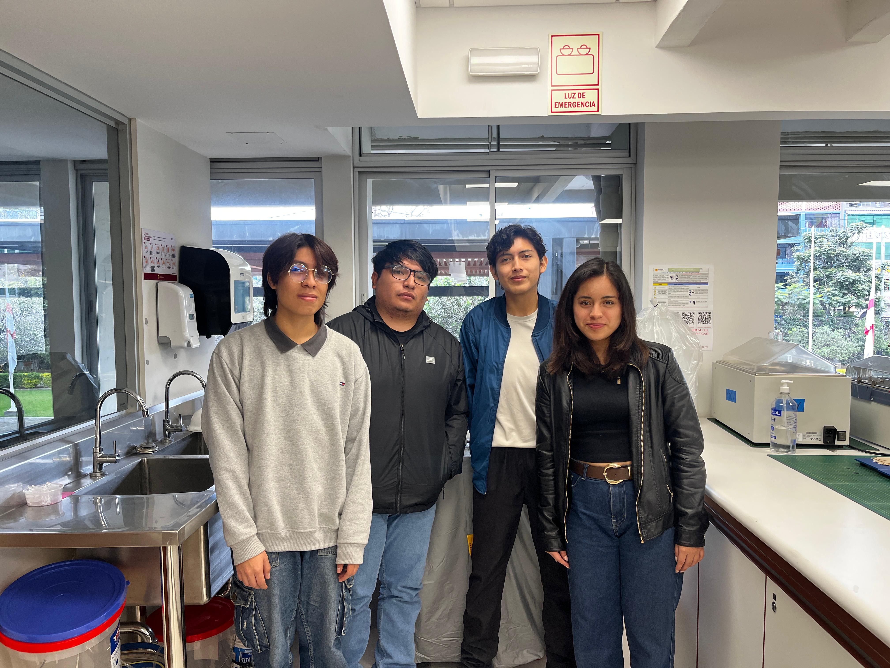

# Grupo 9 Fundamentos de Diseño 2025-2🌍

  
  
  
  

Carrera de Ingeniería Ambiental / Informática  
**Universidad Peruana Cayetano Heredia**
---

## 🌍 Descripción del Equipo  
Somos el **Equipo 9** del curso **Fundamentos de Diseño 2025-2**, conformado por estudiantes de la carrera de Ingeniería Ambiental / Informática  
Nuestro objetivo es aplicar la metodología de diseño para generar soluciones innovadoras con impacto social, tecnológico y ambiental.  

Nos interesa trabajar en los siguientes **Objetivos de Desarrollo Sostenible (ODS):**    
- ODS 11: Ciudades y Comunidades Sostenibles

- ODS 13: Acción por el Clima

---

## 💦 Nuestra Problemática
En Lima Norte, particularmente en distritos como San Martín de Porres, Los Olivos, la calidad del aire presenta niveles preocupantes debido a la alta concentración de material particulado PM₂.₅ generado por el transporte vehicular, la quema de combustibles y la escasa regulación de emisiones en zonas urbanas altamente transitadas. Este problema se intensifica en espacios cerrados como aulas escolares y universitarias, donde la falta de sistemas de ventilación adecuados y el hacinamiento estudiantil provocan una acumulación de contaminantes y dióxido de carbono.

## 📸 Fotografía del Equipo  

   
  <em>Figura 1. Fotografía del equipo</em>

---

## 👥 Integrantes del Equipo  

| Foto | Nombre | Rol | Intereses |
|------|--------|-----|-----------|
|  | **Verenisse Mary Quispitongo León** | Líder del equipo | Innovación social, sostenibilidad |
|  | **Josue Enmanuel Sayago Moran** | Responsable de investigación | Gestión ambiental, desarrollo comunitario |
|  | **Antony Geampier Zuñiga Vásquez** | Diseñador/a | Diseño de prototipos, creatividad aplicada |
|  | **César Alejandro Aarón Apcho Meneses** | Programador/a - Modelador/a | Programación, análisis de datos, simulación |

---

## 📌 Resumen Final  
Este README resume quiénes somos, qué nos motiva y en qué ODS queremos enfocar nuestro trabajo durante el curso.  

